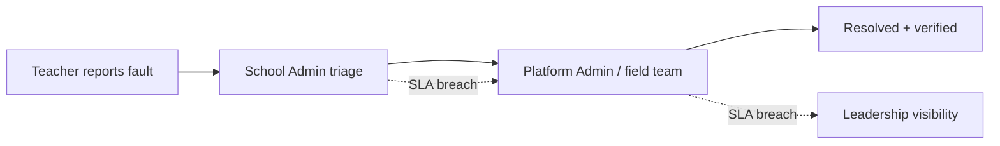

# Technical Support System — Production Field-Support Platform

> The single channel through which Opportunity Education Tanzania's **36 partner schools** and its ICT field team report, triage and resolve technical faults.
> **Status:** in production · **Role:** Software Developer (Partnership Network & Development Team) · **2026**

Technical overview — this repository documents the system I designed and shipped at [Opportunity Education Tanzania](https://www.opportunityeducation.org/); the production codebase is proprietary.

## The problem

Before this system, a broken tablet or a school with no connectivity was fixed through phone calls and memory. Faults sat unowned: no record of who reported what, no deadline, no escalation when a technician was overloaded, and leadership had no way to see which schools were quietly failing. Three teams tracked the same reality in separate spreadsheets.

## The system

**Stack:** Node.js · Express · PostgreSQL · JWT · Cloudinary CDN · Render · cPanel — **112 REST endpoints over a 23-table schema.**

### Automated SLA engine

Every fault is triaged into one of four priority tiers with hard deadlines and automatic breach detection — no reported fault sits unowned:

| Priority | Resolution deadline |
|---|---|
| Critical | ≤ 2 hours |
| High | ≤ 8 hours |
| Medium | ≤ 24 hours |
| Low | ≤ 72 hours |

### Escalation chain

### Four-tier role-based access control

A 4-tier RBAC model across all 112 endpoints: every role sees **exactly** the schools and records it is permitted to see — and nothing more. School admins manage their own school; field engineers see their assigned region; platform admins see the whole network. Every state change lands in an **audit trail**.

### Tablet-fleet management

Every device tracked by serial number, class assignment and full service history, with CSV import/export for bulk operations — replacing the spreadsheets that could not answer "which tablets has this school, and what has been repaired on each?"

### Weekly school health check-ins

Structured per-school check-ins across **connectivity, tablets, platform and power**, turning ad-hoc status calls into comparable data the team can act on over time.

## Impact

- One channel for 36 schools instead of phone calls and memory.
- Deadlines and breach detection instead of unowned faults.
- A complete audit trail for every fault and device.
- Leadership sees network health without waiting for someone to compile it.

---
*Built during my software developer placement at Opportunity Education Tanzania. Questions: **claytonecurth@gmail.com***

