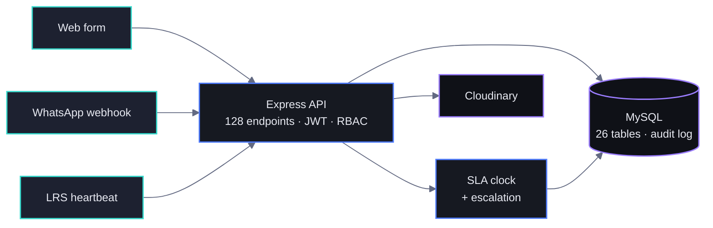

# Technical Support System

> The single channel through which Opportunity Education Tanzania's **36 partner schools** and its ICT field team report, triage and resolve technical faults.
> **Status:** in production · **Role:** Software Developer, Partnership Network & Development Team · **2026**

Technical overview. The production codebase is proprietary and is not published here; this page describes the system, the decisions inside it, and why each one is the way it is.

## The problem

Before this system, a broken tablet or a school with no connectivity was fixed through phone calls and memory. Faults sat unowned: no record of who reported what, no deadline, no escalation when a technician was overloaded, and leadership had no way to see which schools were quietly failing. Three teams tracked the same reality in separate spreadsheets.

The harder half of the problem is that the people closest to a fault are the least likely to file one. A teacher with a dead tablet has a class in front of them. So the system does not depend on anybody opening the app.

## Three ways a fault gets in

| Channel | How it starts | What the system does |
|---|---|---|
| **Web form** | A teacher or school admin files a report | Auto-routes it, stamps a deadline |
| **WhatsApp** | A teacher messages the support number | The assistant replies with first steps, then offers to log it |
| **LRS heartbeat** | Nobody does anything | A school's learning server stops checking in; the monitor opens a **critical** ticket against that school by itself |

The third one is the point. A silent server is the failure a school is least likely to report, because from inside the classroom it just looks like a slow morning.

Both non-web channels stamp the ticket with the channel they arrived on, so the field team can see at a glance which schools only ever reach them by WhatsApp — usually the ones with the worst connectivity.

**A phone number is not authentication.** An unmatched WhatsApp number may file a fault against a school code it supplies, is recorded as unverified, and can never read anything back. Being able to report a problem and being able to read a school's records are different rights, and only one of them can be granted by knowing a phone number.

## Who holds a fault

A fault has to belong to somebody the moment it exists, and the right somebody is usually not the engineer.

| Reported by | Assigned to | Level | Also |
|---|---|---|---|
| Teacher | *nobody yet* | school | Their school admin is notified — that is the person who can walk to the room |
| Teacher, critical | Field engineer | platform | The school admin is still told, and told why it skipped them |
| School admin | Field engineer | platform | They **are** the school level |

It originally assigned the field engineer for everybody. That skipped the one person who could have solved most of them in five minutes by walking down a corridor.

**A teacher cannot change a fault's status.** They own the row, so the access check passes — but closing your own ticket takes it out of the school admin's queue before anyone has looked at it. Teachers report, and teachers rate.

**Who is allowed to say it was fixed** is a separate question again. The rating token goes only to the teacher who reported the fault, or a school admin of that school. It is never issued to a platform admin, and never appears in a list response — handing it to head office would be handing them the school's answer to "was this actually fixed?"

## The clock

| Priority | Target |
|---|---|
| Critical | ≤ 4 hours |
| High | ≤ 24 hours |
| Medium | ≤ 72 hours |
| Low | ≤ 168 hours |

The deadline is written onto the row when the fault is filed, not calculated when somebody opens a report. A breach escalates on its own, up the owner's own chain — a teacher's escalation reaches their school administrator, not a shared support mailbox, and if that school has no active administrator it falls back to email and the reply says so rather than failing silently.

## Who sees what

**A permission has two halves, and both have to be set.** One marker hides the navigation link; a separate guard refuses the route. Setting only the first gives you a page that is invisible and still reachable by typing its address — which is how a page once rendered for every role and merely failed to load its data. A suite of **124 assertions** now fails the build if the two halves disagree.

**A delegate never outranks the delegator.** A school admin can hand tablet-inventory write access to a teacher; the grant is re-read on every request, so revoking it bites immediately rather than at the delegate's next login. But a school admin cannot delete a device, so neither can a teacher they granted.

**The interface asks the server what it may do.** Write controls are gated on a capability the API returns, never on the role in local storage — a grant made after login would not appear, and a revoked one would leave buttons that 403.

## When the network isn't there

Schools lose connectivity for hours. A report written during that window is queued in the browser, **with its photographs** — image blobs held in IndexedDB and replayed later as the identical multipart request the online form would have sent.

Images are downscaled before they are stored (measured: 371 KB → 81 KB) and a size budget decides what fits, naming anything it had to leave behind rather than dropping it quietly. The "reports waiting to sync" banner is mounted by the application shell rather than by one page, because the person most likely to be offline is a teacher who never opens the tracker.

## Knowing what is actually running

`/api/health` reports the commit the **process** is running, read once at boot — not the commit in the working tree, and not what the static files say. A deploy once left new assets on disk while the old process was still serving them; files on disk are never proof of a deploy.

The same endpoint publishes feature flags — AI, email, SMS, WhatsApp inbound and send, heartbeat, uploads — each asked of the service's own configuration check, so "the assistant says it is not configured" can be diagnosed without server access.

Nine verification suites run the behaviour that matters: the role matrix, the school escalation chain, teacher scoping, offline de-duplication, the heartbeat monitor, WhatsApp intake, the visit planner, analytics trends and the fault lifecycle. They provision their own fixtures and remove them afterwards, because suites pinned to accounts that happened to exist locally all broke the day the database was reseeded.

## Architecture

Schema changes are **additive only**. New columns are nullable or defaulted, migrations run on boot, and dropping or renaming anything is a separate, later, explicitly confirmed change — the expand-and-contract discipline, so a deploy can never take data with it.

## Stack

| Layer | Choice |
|---|---|
| Runtime | Node.js, Express |
| Database | MySQL / MariaDB — 26 tables, audit log, additive migrations on boot |
| API | 128 REST endpoints across 21 route modules, JWT, 4-role RBAC plus capability checks |
| Frontend | Vanilla JavaScript SPA, hash routing, no framework — 16 role-gated pages, served by the same Express process |
| Offline | Progressive web app, IndexedDB request queue with binary attachments |
| Media | Cloudinary |
| Messaging | WhatsApp inbound webhook and send, email, SMS |
| Hosting | cPanel / DirectAdmin, Passenger |

## Impact

- One channel for 36 schools instead of phone calls and memory.
- Faults that arrive without anybody filing them.
- Deadlines and automatic escalation instead of unowned tickets.
- A complete audit trail for every fault and every device.
- Leadership sees network health without waiting for someone to compile it.

## Reach me

Happy to walk through the intake routing, the escalation chain, the offline queue or the role matrix in detail.

Built during my software developer placement at Opportunity Education Tanzania. The system described here belongs to Opportunity Education Tanzania and its production codebase is not published. The artwork and written content of this page are © 2026 Claytone Curthberth Mhina and are not licensed for reuse without written permission.
