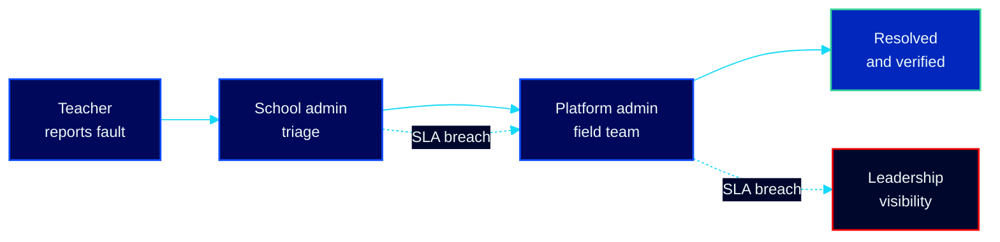

# Technical Support System — Production Field-Support Platform

> The single channel through which Opportunity Education Tanzania's **36 partner schools** and its ICT field team report, triage and resolve technical faults.
> **Status:** in production · **Role:** Software Developer (Partnership Network & Development Team) · **2026**

Technical overview — this repository documents the system I designed and shipped at [Opportunity Education Tanzania](https://www.opportunityeducation.org/); the production codebase is proprietary.

## The problem

Before this system, a broken tablet or a school with no connectivity was fixed through phone calls and memory. Faults sat unowned: no record of who reported what, no deadline, no escalation when a technician was overloaded, and leadership had no way to see which schools were quietly failing. Three teams tracked the same reality in separate spreadsheets.

## The system

**112 REST endpoints over a 23-table schema**, built so that the deadline — not a person's memory — is what moves a fault forward.

### Automated SLA engine

Every fault is triaged into one of four priority tiers with hard deadlines and automatic breach detection — no reported fault sits unowned:

| Priority | Resolution deadline |
|---|---|
| Critical | ≤ 2 hours |
| High | ≤ 8 hours |
| Medium | ≤ 24 hours |
| Low | ≤ 72 hours |

### Escalation chain

Breach detection is not a report someone runs. It fires on its own, and it keeps climbing until the fault is owned.

### Four-tier role-based access control

A 4-tier RBAC model across all 112 endpoints: every role sees **exactly** the schools and records it is permitted to see — and nothing more. School admins manage their own school; field engineers see their assigned region; platform admins see the whole network. Every state change lands in an **audit trail**.

### Tablet-fleet management

Every device tracked by serial number, class assignment and full service history, with CSV import/export for bulk operations — replacing the spreadsheets that could not answer "which tablets has this school, and what has been repaired on each?"

### Weekly school health check-ins

Structured per-school check-ins across **connectivity, tablets, platform and power**, turning ad-hoc status calls into comparable data the team can act on over time.

## Stack

| Layer | Choice |
|---|---|
| Runtime | Node.js, Express |
| Database | PostgreSQL — 23 tables, audit trail on every state change |
| API | 112 REST endpoints, 4-tier RBAC enforced per endpoint |
| Auth | JWT |
| Media | Cloudinary CDN |
| Infra | Render, cPanel |

## Impact

- One channel for 36 schools instead of phone calls and memory.
- Deadlines and breach detection instead of unowned faults.
- A complete audit trail for every fault and device.
- Leadership sees network health without waiting for someone to compile it.

## Reach me

Happy to walk through the SLA engine, the RBAC model or the fleet schema in detail.

Built during my software developer placement at Opportunity Education Tanzania. The system described here belongs to Opportunity Education Tanzania and its production codebase is not published. The artwork and written content of this page are © 2026 Claytone Curthberth Mhina and are not licensed for reuse without written permission.

