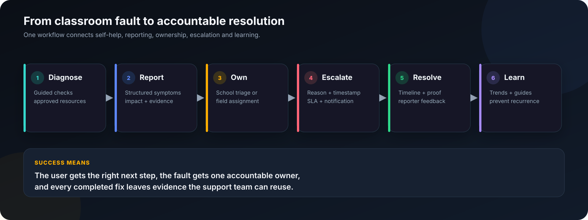
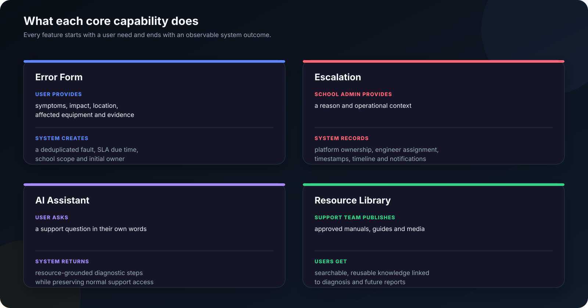
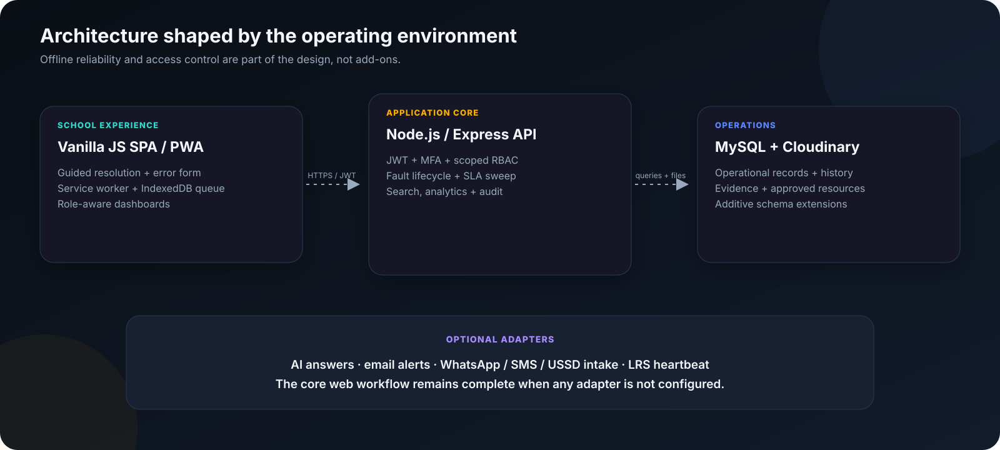

# Technical Support System

An offline-first support system that helps schools diagnose, report, route, escalate and resolve technical faults without losing work when the internet is unreliable.

**Software Engineer case study by Claytone Curthberth Mhina.**

## The challenge

A fault in a classroom can interrupt learning immediately, but the information needed to resolve it is usually scattered across calls, chat messages and spreadsheets:

- the symptoms and their impact;
- what the teacher or school has already tried;
- photographs or other evidence;
- the person currently responsible;
- the response deadline;
- the affected school and equipment;
- the resolution and whether it worked.

Weak connectivity adds a harder failure mode: the user can complete a report and lose it before the server receives it—or retry it and create duplicates.

The system provides one support record, one ownership chain and one history from the first diagnostic step to verified resolution.



## How it helps each user

| User | What the system helps them do |
|---|---|
| **Teacher** | Follow guided checks, search approved support material, report a fault with evidence, track their own report and rate the outcome |
| **School administrator** | Triage teacher reports, resolve local issues, manage school context and escalate work that needs field or head-office support |
| **Field engineer** | See assigned schools and faults, review diagnostic evidence, plan visits, check equipment/spares and record the resolution |
| **Platform administrator** | Assign ownership, monitor SLA risk, review trends, govern access, audit activity and identify recurring operational problems |

## Core capabilities



### Error Form

The report form captures the information needed to act, not only a title and description:

- school, location and reporter context;
- category, priority and operational impact;
- symptoms, affected equipment and steps already attempted;
- photographs and supporting attachments;
- the troubleshooting guide used before reporting.

When submitted, the API validates the user's school scope, generates a unique fault code, calculates the SLA due time, chooses the correct initial owner and records the intake channel. A stable client reference makes offline retries idempotent, so a lost response does not create a second fault.

### Escalation

Escalation is a business operation, not a cosmetic status change.

A school administrator supplies a reason and optional context. The system then:

1. moves the fault to platform-level ownership;
2. assigns the school's field engineer when one is available;
3. records who escalated it and when;
4. adds an escalation entry to the fault timeline;
5. notifies head office and the assigned engineer in-app;
6. preserves the action in the audit trail.

Teachers cannot bypass the school administrator, and a generic status update cannot imitate an escalation. This prevents a fault from appearing escalated while missing its reason, owner and notifications.

### AI Assistant

The assistant helps a user turn a symptom into an actionable diagnostic path. It uses the support context and approved resources to recommend checks and relevant material instead of acting as a separate source of truth.

Its role is to help the person standing near the equipment:

- clarify the reported symptom;
- propose safe diagnostic steps in sequence;
- surface relevant guides and resources;
- help the user decide whether to continue locally or file a fault.

The assistant is optional. If the model service is unavailable, guides, search, the Resource Library and the normal reporting workflow continue to work.

### Resource Library

The Resource Library gives users one searchable source for approved support knowledge. It supports manuals, documents, images, audio and video stored through Cloudinary.

Resources are useful in three places: self-service before a report, evidence during diagnosis, and reusable guidance after a recurring fault has been understood. Access and write permissions are role-scoped, while the stored metadata makes material searchable by title, type, category and context.

### Offline reporting

The PWA keeps the application shell and support content available on weak or missing connections. If a report cannot reach the API:

1. the request and its attachments are stored in IndexedDB;
2. images are compressed to a browser storage budget;
3. the shell shows that work is waiting to sync;
4. reconnection replays the original multipart request;
5. the server uses `client_ref` to reject duplicate creation.

Offline mode therefore preserves both the report and its evidence, rather than displaying a success message for data that never reached support.

### Follow-Up and SLA

The Follow-Up Center brings together open, in-progress and escalated faults that need action. Each fault has a priority-based due time:

| Priority | Target |
|---|---:|
| Critical | 4 hours |
| High | 24 hours |
| Medium | 72 hours |
| Low | 168 hours |

An authenticated scheduled sweep processes overdue faults transactionally. Row locking and a processed flag make it idempotent when cron calls overlap. A school-level breach is moved to platform visibility, assigned where possible, written to the timeline and surfaced through in-app notifications. Work already in progress keeps its working state while head office is notified of the breach.

### Field operations and asset context

A fault does not exist separately from the school and equipment around it. School profiles, weekly check-ins, visit planning, tablet/LRS inventory, warranties, suppliers, batches and spare parts give an engineer the context needed to diagnose remotely and arrive prepared when travel is necessary.

## Fault lifecycle and ownership rules

```text
Teacher report ──> School triage ──> In progress ──> Resolved ──> Feedback
                         │
                         └── Escalate with reason ──> Platform / field engineer

Critical impact ───────────────────> Field engineer immediately
School-admin report ───────────────> Field engineer immediately
```

The lifecycle moves forward. A resolved fault cannot be silently reopened because that would rewrite its SLA and satisfaction history; a recurrence is recorded as a new fault and can be linked through its context. First-response, escalation and resolution timestamps use the database clock so analytics do not mix server time zones.

## Architecture



| Layer | Implementation |
|---|---|
| Frontend | Vanilla JavaScript SPA, hash routing, service worker and IndexedDB |
| Backend | Node.js 18+, Express and REST APIs |
| Data | MySQL/MariaDB with additive, replay-safe schema extensions |
| Authentication | JWT, bcrypt, TOTP MFA, recovery codes and session revocation |
| Authorization | Four roles plus school, reporter, assignment and delegated-capability scope |
| Files | Cloudinary-backed evidence and resource storage |
| AI | AWS Bedrock integration with resource-grounded support context |
| Production | cPanel/CloudLinux, LiteSpeed/Passenger and local MySQL |
| Deployment | Signed GitHub webhook, fast-forward-only update, restart and build-aware health check |

Optional WhatsApp, SMS/USSD, email and LRS heartbeat adapters feed the same support domain when configured. They do not replace the web workflow or its ownership rules.

## Engineering decisions

### In-app ownership before external messaging

The fault record and in-app notification are authoritative because external services may be unconfigured, delayed or unavailable. Email, SMS and messaging can extend reach, but they do not decide whether the workflow exists.

### Additive database evolution

Production schema changes add nullable or defaulted fields and replay safely at startup. Destructive changes require a separate migration and recovery decision, reducing the chance that a deploy damages existing support history.

### Capabilities, not trusted browser roles

The interface asks the API what the current user may do. Hiding a navigation link is not authorization; the route independently checks role and tenant scope. Delegated inventory access is re-read on each request, so revocation takes effect immediately.

### Observable deployment state

`GET /api/health` reports the commit loaded by the running process and which optional services are actually configured. Static files on disk are not treated as proof that Passenger restarted successfully.

## Verification

Executable suites cover the behavior that carries the most operational risk:

- role and tenant-access boundaries;
- teacher → school → field/head-office routing;
- explicit escalation and forward-only lifecycle transitions;
- Follow-Up multi-status filtering;
- offline replay and duplicate protection;
- transactional, idempotent SLA breach processing;
- attachment, resource, visit, inventory and analytics workflows;
- webhook and optional-integration security boundaries.

The focused workflow checks currently pass **4/4** for Follow-Up filtering, **64/64** for the school support chain and **9/9** for SLA breach processing. Verification scripts create scoped fixtures and remove only the records they own.

## Showcase visuals

The diagrams in this README are generated from a dependency-free Node.js script so their copy, colors and layout stay reviewable in source:

```bash
node scripts/generate-showcase-visuals.mjs
```

Static SVG is deliberate: GitHub renders it sharply at any width, keeps it lightweight and exposes useful alternative text. Motion should be reserved for a sequence that cannot be understood in one frame; GitHub-safe animation would be exported as GIF while retaining the SVG source.

## Source

The maintained implementation and its product-priority document are available in [Claytonee/Troubleshooting-System](https://github.com/Claytonee/Troubleshooting-System).

## Contact

[](mailto:claytonecurth@gmail.com)

<sub>Software engineering case study by Claytone Curthberth Mhina. The system described here was built for Opportunity Education Tanzania. The artwork and written content of this showcase are © 2026 Claytone Curthberth Mhina.</sub>
