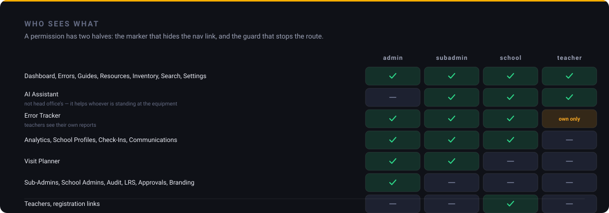

# Offline-First School Technical Support & Knowledge System

> A support operating system for Opportunity Education Tanzania's partner schools: help the school solve common faults, capture the ones it cannot solve, and keep one accountable owner from classroom to resolution.

**Status:** in production · **Role:** Software Developer, Partnership Network & Development Team · **2026**

The product is not a WhatsApp bot, SMS gateway, or LRS-monitoring demo. Those are optional adapters. Its core value is a reliable support workflow designed for schools with intermittent connectivity and a small field team covering many sites.

## The problem it solves

A technical fault can interrupt a lesson long before head office learns about it. Phone calls and spreadsheets lose context: who reported it, what was already tried, who owns it, when it became urgent, what equipment is affected, and whether the fix actually worked.

This system turns that fragmented process into one operational record and one clear chain of responsibility.

## The core workflow

1. **Try the right fix first.** Guided troubleshooting and approved resources help a teacher or school administrator resolve common problems without waiting for travel.
2. **Report reliably.** If the fault remains, the web app captures symptoms, impact, location, equipment, evidence, and the guide already attempted.
3. **Keep working offline.** Reports and photographs queue in IndexedDB, then replay as the original multipart request when connectivity returns. A client reference prevents duplicate tickets.
4. **Route to the nearest capable owner.** A teacher's report starts with their school administrator. Critical faults and school-admin reports reach the assigned field engineer immediately.
5. **Escalate with context.** The school administrator can escalate to head office with a reason. The system records the owner, timestamp, timeline entry, and in-app notifications.
6. **Close the loop.** Resolution history, CSAT, recurrence trends, visits, guides, manuals, inventory, warranties, and spares turn completed work into reusable operational knowledge.

## Ownership is a product feature

| Reported by | Initial owner | Why |
|---|---|---|
| Teacher | School administrator | The closest person who can inspect the classroom and solve a local issue |
| Teacher, critical impact | Field engineer, with school notified | Teaching cannot wait for the normal triage step |
| School administrator | Field engineer | The report has already passed the school level |

A teacher can report, add evidence, follow their own fault, and rate the outcome. They cannot close or escalate it past their school administrator. Escalation is a dedicated action—not a status value—because it must carry a reason, ownership change, timestamp, audit entry, and notification.

## SLA execution, not an SLA label



| Priority | Target |
|---|---:|
| Critical | 4 hours |
| High | 24 hours |
| Medium | 72 hours |
| Low | 168 hours |

The due time is stored when the fault is created. An authenticated scheduled sweep locks each overdue row, processes it once, escalates school-level work to head office, assigns the school's field engineer where available, and creates in-app notifications plus a timeline/audit record. Repeated or overlapping sweeps do not duplicate the escalation.

## Built for unreliable connectivity

Offline behavior is part of the domain, not a cosmetic PWA badge:

- The application shell and support content remain available without a connection.
- Pending reports are visible outside a single page.
- Attachments stay with the queued request and images are compressed to a storage budget.
- Replay preserves the online API contract.
- A stable `client_ref` makes lost responses and retries idempotent.

## Four roles, scoped at both UI and API



- **Platform admin:** governance, assignment, analytics, security, audit, and system configuration
- **Field engineer:** assigned schools, remote diagnosis, visits, inventory context, and resolution
- **School admin:** local triage, teacher management, escalation, and school-level visibility
- **Teacher:** guided help, own reports, evidence, progress visibility, and feedback

Navigation visibility and route authorization are separate controls. Tenant checks bind school users to their school, teachers to their own reports, and field engineers to assigned schools. MFA, recovery codes, security events, and audit trails protect the human workflow around those permissions.

## Operational knowledge and field work

The system connects support records that are usually separated:

- Guided resolution and a searchable resource library
- Recurring-fault, response-time, resolution-time, and SLA analytics
- School health, weekly check-ins, and preventive maintenance
- Visit planning based on unresolved work and school context
- Tablet/LRS inventory, warranty dates, suppliers, batches, and spares
- CSAT owned by the reporter or their school—not by head office

The product goal is fewer disrupted lessons and better fixes. Channel volume is not a success metric.

## Optional adapters

| Adapter | Purpose | Product rule |
|---|---|---|
| LRS heartbeat | Detect an installed school server or uplink becoming unreachable | Expand only where an agent is installed and earlier detection improves response time |
| WhatsApp | Alternate inbound reporting | Use only when schools prefer it and reports retain enough identity and diagnostic context |
| SMS / USSD | Low-bandwidth intake and alerts | Use where it reaches otherwise excluded users; never make it the main workflow |
| Email | Best-effort event notification | The in-app record remains authoritative |
| AI assistant | Resource-grounded support answers | Optional enhancement; approved knowledge remains usable without it |

Missing credentials do not pretend to be working features. Integrations fail closed or degrade to the core in-app workflow, and `/api/health` reports what is actually configured in the running process.

## Architecture

```text
Vanilla JS SPA / PWA
  ├─ Service Worker + IndexedDB offline queue
  └─ Role-aware support interface
             │ HTTPS / JWT
             ▼
Node.js + Express API
  ├─ authentication, MFA, RBAC and tenant scope
  ├─ fault lifecycle, SLA sweep and audit trail
  ├─ guided resolution, analytics and field operations
  └─ optional integration adapters
             │
             ├─ MySQL / MariaDB
             └─ Cloudinary for uploaded evidence and resources
```

| Layer | Choice |
|---|---|
| Backend | Node.js 18+, Express |
| Database | MySQL / MariaDB with additive, replay-safe schema extensions |
| Frontend | Vanilla JavaScript SPA/PWA with hash routing |
| Offline | Service worker, IndexedDB, multipart replay, duplicate protection |
| Security | JWT, bcrypt, TOTP MFA, recovery codes, scoped RBAC, security events |
| Hosting | cPanel/CloudLinux, LiteSpeed/Passenger, MySQL on the same host |
| Deployment | Signed GitHub webhook, fast-forward-only update, Passenger restart, build-aware health check |

## Engineering proof

Executable verification covers the role matrix, teacher → school → head-office chain, multi-status Follow-Up query, forward-only lifecycle, offline de-duplication, SLA idempotency, teacher scope, security boundaries, visits, analytics, and optional adapters. Suites create scoped fixtures and remove only the data they own.

The maintained implementation and current product priorities are in [Claytonee/Troubleshooting-System](https://github.com/Claytonee/Troubleshooting-System).

## Reach me

[](mailto:claytonecurth@gmail.com)

Happy to walk through the ownership model, offline queue, SLA processing, security boundaries, or field-support workflow.

<sub>Built during my software developer placement at Opportunity Education Tanzania. The system described here belongs to Opportunity Education Tanzania. The artwork and written content of this page are © 2026 Claytone Curthberth Mhina and are not licensed for reuse without written permission.</sub>
