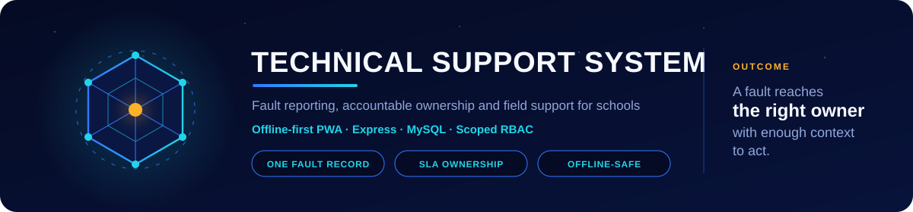
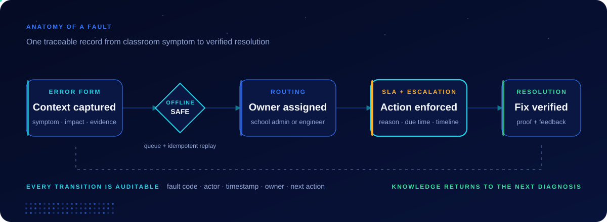
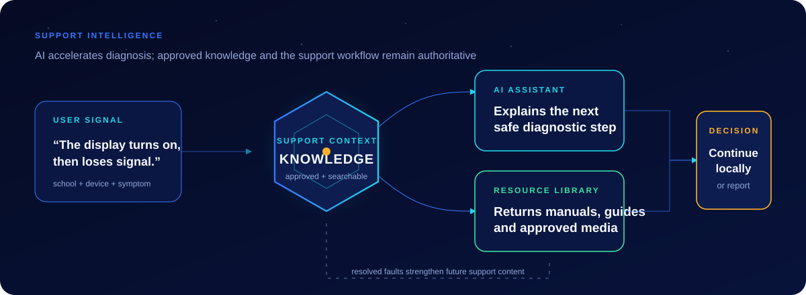
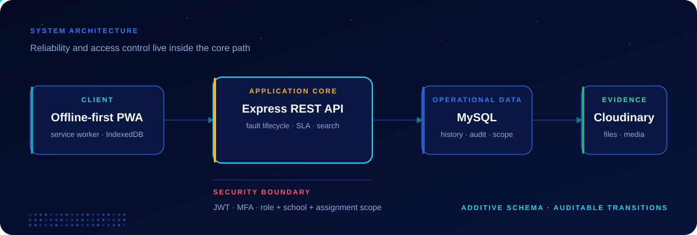

# Technical Support System — Engineering Case Study

An offline-first support platform that helps schools diagnose, report, route, escalate and resolve technical faults through one accountable workflow.

**Software Engineer:** Claytone Curthberth Mhina · **2026**

## The challenge it solves

When classroom technology fails, support often begins with an incomplete call or chat message. The support team must then rediscover the school, device, symptoms, impact, attempted fixes and responsible person while teaching is already interrupted. Weak connectivity can also lose a completed report or create duplicates when the user retries.

This system turns that fragmented exchange into one fault record with diagnostic context, an accountable owner, an SLA, a complete timeline and a verified resolution. It gives the person near the equipment a useful next step and gives the support team the evidence needed to act.

## Anatomy of a fault

The same fault code follows the issue from intake to closure. Offline retries reuse a stable client reference; routing chooses school or field ownership; escalation records its reason, actor and time; resolution retains evidence and reporter feedback instead of ending as an untraceable status change.

## What the core capabilities do

| Capability | Help for the user | System responsibility |
|---|---|---|
| **Error Form** | Report the real symptom once, with location, impact, equipment, attempted checks and attachments. | Validate school scope, create a unique fault code, calculate the SLA and assign the initial owner. |
| **Escalation** | Move a fault beyond school-level support when local action is insufficient. | Require a reason, transfer ownership, assign the field engineer where available, notify the responsible people and write the event to the timeline. |
| **AI Assistant** | Turn a symptom into a short sequence of safe diagnostic checks. | Use support context and approved resources, then let the user continue locally or create a normal fault report. It is assistance—not the source of truth. |
| **Resource Library** | Find manuals, guides, images, audio and video without searching through old messages. | Keep approved support material searchable by title, type, category and context, with role-scoped publishing access. |

## Diagnosis backed by knowledge

The AI Assistant and Resource Library share a support context but serve different needs: the assistant explains the next diagnostic step, while the library returns durable source material. If AI is unavailable, search, guides and the complete reporting workflow continue to work.

## Engineering underneath

| Concern | Engineering decision |
|---|---|
| **Unreliable connectivity** | Service worker + IndexedDB preserve reports and attachments; reconnect replays the original multipart request. |
| **Duplicate offline retries** | A stable `client_ref` makes fault creation idempotent. |
| **Ownership and SLA** | Priority sets the due time; forward-only transitions, explicit escalation and transactional breach processing preserve accountability. |
| **Access control** | JWT, TOTP MFA and route-level role, school, reporter, assignment and delegated-capability checks. |
| **Operational history** | Additive database evolution, timeline events and database-clock timestamps protect existing support history. |
| **Evidence and knowledge** | Cloudinary stores fault attachments and approved support media; MySQL retains their searchable operational context. |

### Runtime stack

`Vanilla JavaScript SPA/PWA` · `Node.js 18+` · `Express` · `MySQL/MariaDB` · `Cloudinary` · `AWS Bedrock` · `cPanel/Passenger`

## Operational scope

Teachers can diagnose, report and track their own faults. School administrators triage and escalate school-level work. Field engineers see assignments, diagnostic evidence, school context, equipment and spares. Platform administrators govern ownership, SLA risk, permissions, trends and audit history.

The same domain also supports visit planning, weekly school check-ins, inventory, warranties, suppliers and spare parts so an engineer can diagnose remotely and arrive prepared when a site visit is necessary.

## Verification

Executable checks cover tenant and role boundaries, teacher-to-school-to-field routing, explicit escalation, forward-only lifecycle rules, offline replay, duplicate protection, Follow-Up filtering and idempotent SLA breach processing. The focused workflow suites pass **4/4**, **64/64** and **9/9** respectively.

## Repository

- Maintained implementation: [Claytonee/Troubleshooting-System](https://github.com/Claytonee/Troubleshooting-System)
- Visual source: [`scripts/generate-showcase-visuals.mjs`](scripts/generate-showcase-visuals.mjs)

The four SVG plates are generated by a dependency-free Node.js script. Their restrained motion uses native SVG animation, while every concept remains understandable in a static frame.

## Contact

Software engineering case study by Claytone Curthberth Mhina. The system described here was built for Opportunity Education Tanzania. Artwork and written content © 2026 Claytone Curthberth Mhina.
